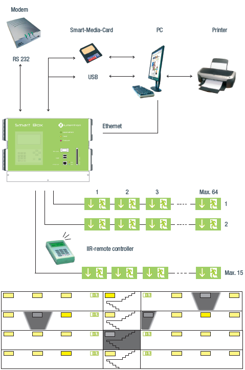

### Smartbox
Emergency Lighting Solutions Smart Center for stand-alone battery operated lamps

The SMART BOX system is a microprocessor controlled monitoring center for stand-alone
battery lights. The BUS system built with two cable core is protected against over-voltage
and polarity interchange and it automatically addresses lights.   960 pieces microprocessor
equipped stand-alone battery or emergency lights with lighting insert can be connected
to the system.

